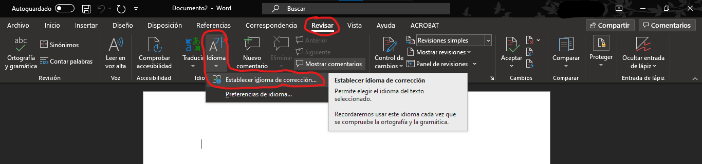
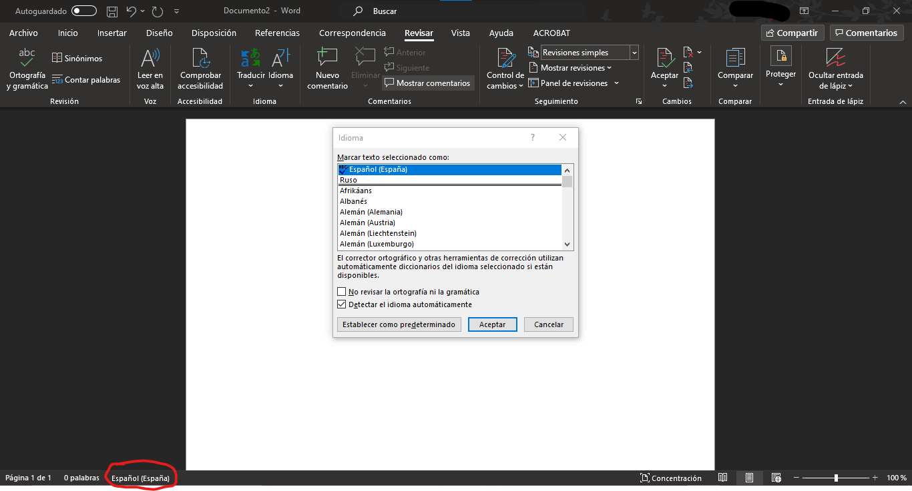
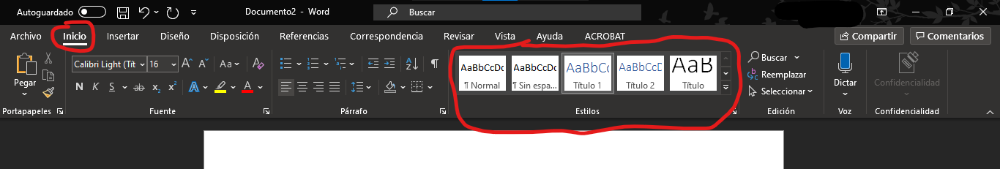
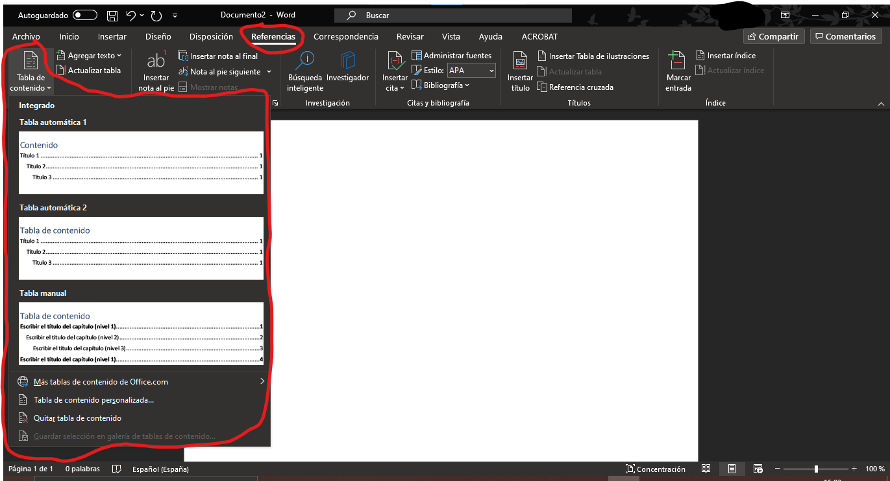
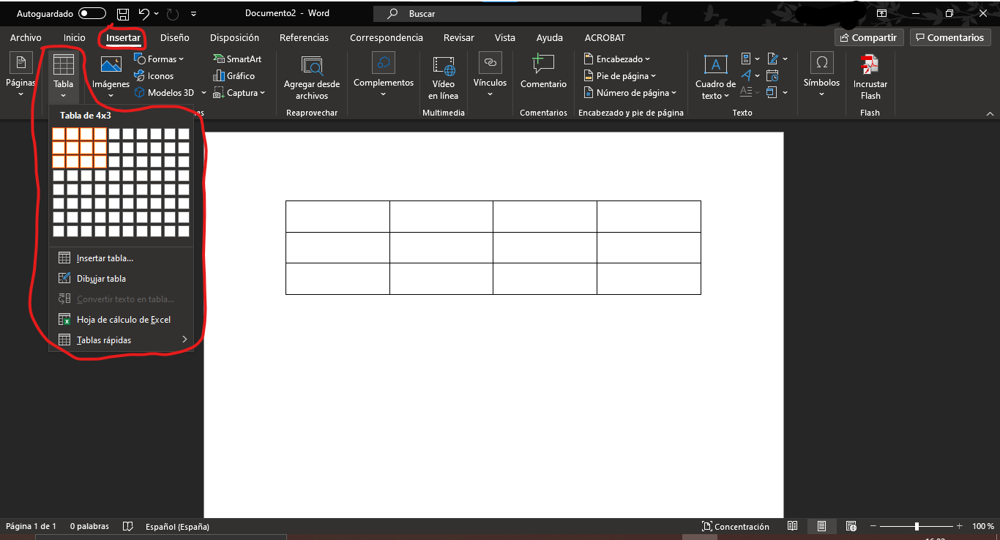
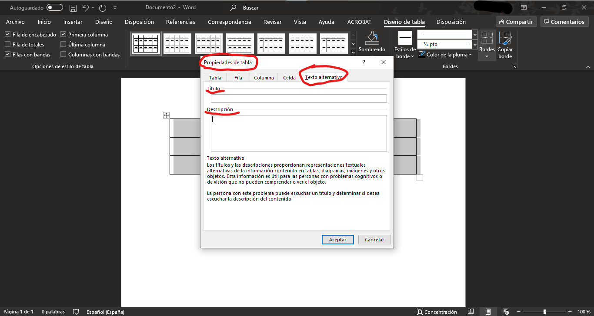
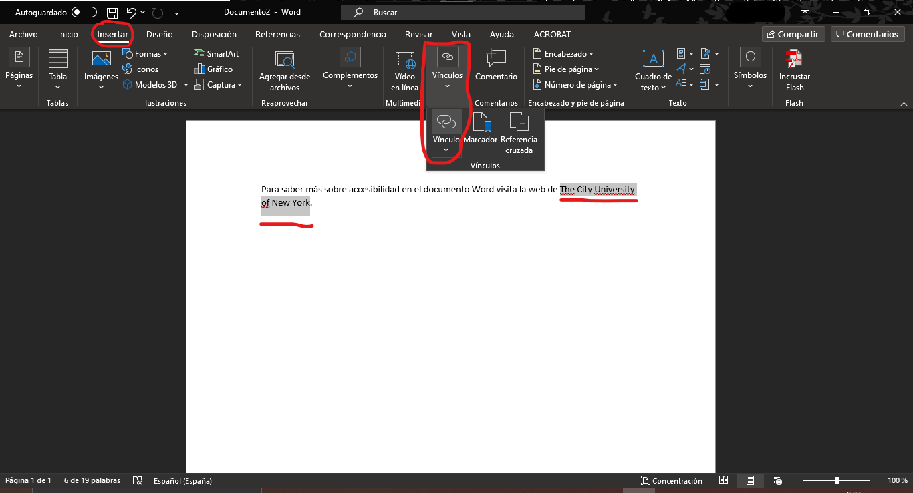
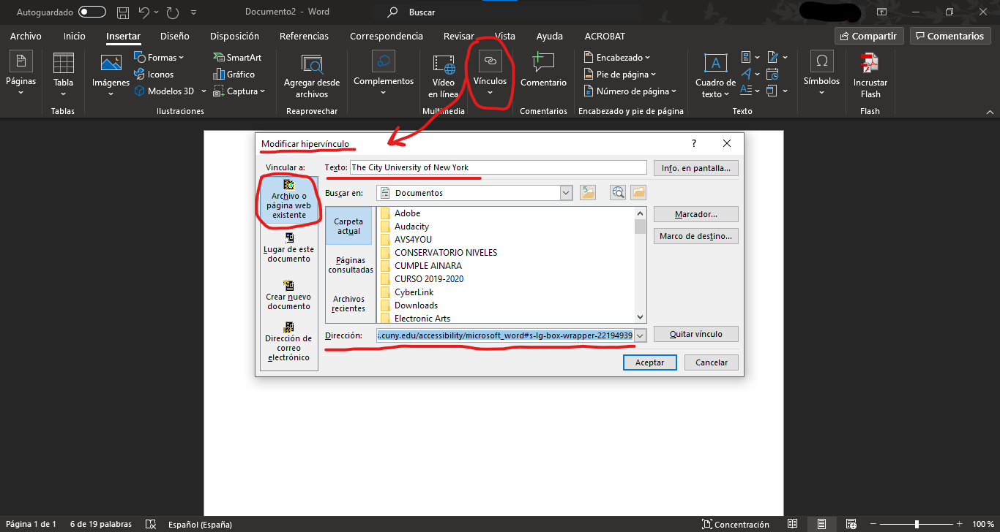
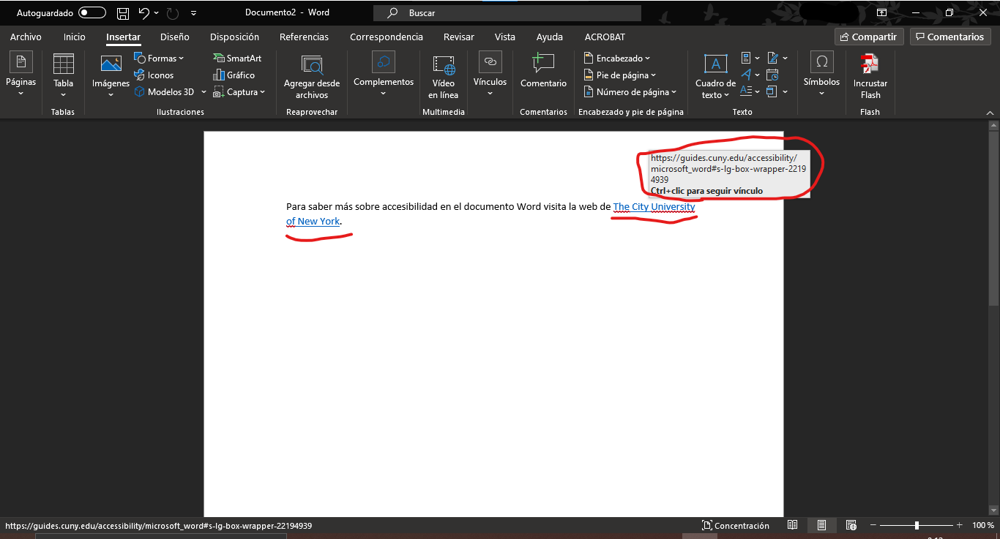
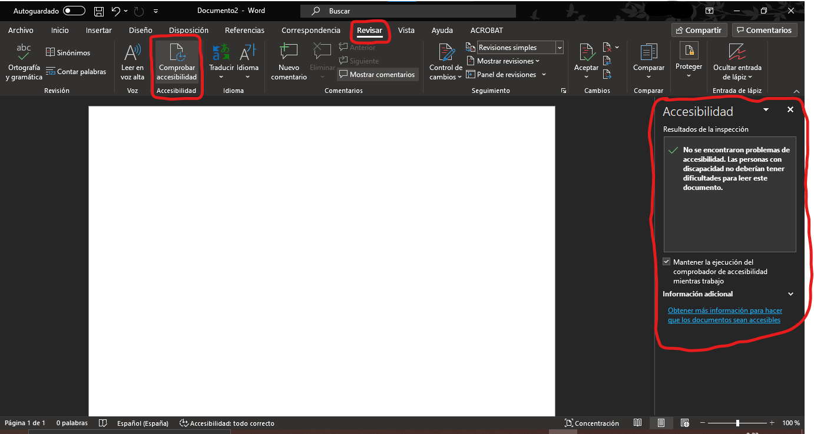

% Accesibilidad en Microsoft Word
% Leire Altamira
% Marzo de 2021

# Introducción

## Microsoft Word

* Hoy en día es común crear documentos a través de Word.
* Es la herramienta principal utilizada por la mayoría de la gente.
* La creación de contenidos accesibles en Word no es muy complicada, siempre que se tengan claras las pautas básicas.

## ¿Por qué crear documentos Word accesibles?

- Permite que los documentos lleguen a la mayor población posible.
- Es útil para las personas que no tienen dificultades.
- Hace más fácil la navegación a través del contenido.
- Si se tiene preparado un documento accesible, se evita perder el tiempo después en caso de que alguien pida que sea accesible.

# Pautas para crear documentos Word accesibles

## Pautas de accesibilidad

1. Idioma del documento
2. Tipografía y legibilidad del contenido
3. Estructura del documento
	- Orden lógico y coherente
	- Niveles de título y títulos descriptivos
	- Índice
4. Contenido del documento
	- Texto accesible
	- Imágenes y tablas
	- Enlaces
5. Comprobador de accesibilidad en Word

# 1. Pautas sobre el idioma del documento

## 1. Idioma del documento

Siempre debe indicarse el idioma en que está escrito un texto. Esto es fundamental para que el sofware pueda realizar su función correctamente.

Ejemplo: un software que convierta el texto a voz.

## 1. Idioma del documento

**¿Cómo se establece el idioma en un documento Word?**

- Existen varias formas para cambiar el idioma.
- **Pestaña "Revisar" -> "Idioma" -> "Establecer idioma de corrección"**
- Es aconsejable activar la opción **"Detectar el idioma automáticamente"**.

## 1. Idioma del documento

{ width=50% }\

{ width=50% }\

# 2. Pautas sobre la tipografía y legibilidad del contenido

## 2. Tipografía y legibilidad del contenido

- Esta pauta de accesibilidad se refiere a la facilidad de lectura de un documento.
- Referencia a: tipo de letra, tamaño, estilo y alineación utilizada.
- Existen dos tipos de letra básicos: las Serif y las Sans Serif.

## 2. Tipografía y legibilidad del contenido: Serif vs. Sans Serif

Serif													Sans Serif
-----													----------
Fuentes más legibles para el **texto impreso**. 		Fuentes más legibles para el **contenido web**.
Times y Times New Roman. 								Verdana, Tahoma, Georgia y Trebuchet MS.

## 2. Tipografía y legibilidad del contenido: Serif vs. Sans Serif

{ width=100% }\

## 2. Tipografía y legibilidad del contenido

- El tamaño de la fuente deberá ser de **12 o 14 puntos**.
- Prevalecerá el **estilo normal**. Se evitarán la cursiva, el subrayado o efectos de texto como sombreado, ya que dificultan la lectura.
- Se deberá **cuidar el interlineado**: ni muy junto ni muy separado. Entre un 25% o 30% superior al tamaño de la letra.

## 2. Tipografía y legibilidad del contenido

- El **texto debe estar en horizontal** y **justificado a la izquierda**.
- El **color de la letra y el fondo deben tener el mejor contraste posible**.
- Evitar el uso de imágenes de fondo, texturas y colores de fondo.

# 3. Pautas sobre la estructura del documento

## 3. Estructura del documento

- La estructura del documento tendrá que seguir un **orden lógico y coherente**.
- **Títulos descriptivos**.
- Uso de **estilos integrados** para estructurar y organizar el documento de forma **jerárquica** con apartados y subapartados.

## 3. Estructura del documento

- El **índice** del documento permite una navegación rápida de los documentos largos.
- Word crea una Tabla de contenido o índice de forma automática desde el menú "Referencias", gracias al uso de la herramienta "Estilos" de título.

## 3. Estructura del documento: los estilos integrados

{ width=100%}\

## 3. Estructura del documento: generación del índice

{ width=100% }\

# 4. Pautas sobre el contenido del documento

## 4. Contenido del documento: texto accesible

El texto accesible está relacionado con una lectura fácil. Para ello, se recomienda seguir unas buenas prácticas:

## 4. Contenido del documento: texto accesible

**Nivel de palabra**

- No usar palabras difíciles, poco habituales o muy técnicas (si se necesita usar este vocabulario, se deberán explicar los términos).
- Evitar el uso de siglas.
- Evitar palabras en otro idioma.
- Evitar metáforas.
- Usar ejemplos para ilustrar la teoría.

## 4. Contenido del documento: texto accesible

**Nivel de frase**

- Frases cortas y en forma afirmativa.
- Separar cada idea con un punto.
- Intentar usar tiempos verbales en presente.
- Explicar ideas o términos en el texto en vez de usar notas a pie de página.
- Evitar expresiones redundantes.
- No poner mucho texto en una página y separar los párrafos con una línea en blanco.

## 4. Contenido del documento: imágenes

- Todas las imágenes del documento deberán ir acompañadas de un **texto alternativo**.
- Las imágenes deberán ir acompañadas de una descripción textual que explique su contenido para aquellos lectores con problemas de visión que necesiten apoyo auditivo.
- Uso de **título** o rótulo en el pie de la imagen.

## 4. Contenido del documento: tablas

- Uso de tablas para mostrar datos, pero sin centrarse en el diseño.
- Uso de texto alterntivo para las tablas y gráficos para que sean visibles para todos los lectores.
- Se deberán acompañar las tablas complejas con un transcripción detallada.
- Su formato estructurado y visual facilita la comprensión de los datos y ahorra espacio.

## 4. Contenido del documento: tablas

**Recomendaciones**:

- Estructura simple y uniforme.
- Título significativo.
- Los encabezados de columna deben especificar la información que contiene.

## 4. Contenido del documento: creación de tablas

{ width=100% }\

## 4. Contenido del documento: tablas con texto alternativo y título

Pasos para añadir un texto alternativo:

1. Con la tabla seleccionada -> click en botón derecho.
2. Seleccionar **"Propiedades tabla"**.
3. Dentro de la nueva ventana -> seleccionar la pestaña **"Texto alternativo"**.
4. Añadir el **título** de la tabla.
5. Añadir una **descripción** de la tabla.

## 4. Contenido del documento: tablas con texto alternativo

{ width=100% }\

## 4. Contenido del documento: enlaces

Para crear enlaces accesibles en Word se deberá evitar poner la dirección completa http.
**Se creará un hipervínculo sobre un texto explicativo del enlace del enlace**.

## 4. Contenido del documento: enlaces

Para crear enlaces accesibles se seguirán los siguientes pasos:

1. Copiar la dirección http.
2. Seleccionar el texto explicativo que queramos convertir en hipervínculo.

## 4. Contenido del documento: enlaces

3. Acceder a la pestaña **"Insertar"** -> **"Vínculos"** -> **"Vínculo"** (se abrirá la ventana "Insertar hipervínculo") -> Seleccionar **"Archivo o página web existente"** -> **Escribir en el cuadro de texto "Dirección"** -> Seleccionar **"Aceptar"**.
4. El resultado es que el texto seleccionado previamente se habrá puesto de color azul y subrayado. Si se pasa el ratón se verá la interactividad.

## 4. Contenido del documento: enlaces

5. Si se hace ctrl+click, te llevará a la página web vinculada.

## 4. Contenido del documento: enlaces

{ width=100% }\

## 4. Contenido del documento: enlaces

{ width=100% }\

## 4. Contenido del documento: enlaces

{ width=100% }\

# 5. Comprobador de accesibilidad en Word

## 5. Comprobador de accesibilidad en Word

El comprobador de accesibilidad en Word está integrada en el programa y nos permite comprobar que cumplimos con los resquisitos de accesibilidad.

Seleccionar ventana "Revisar" -> hacer click en "Comprobar accesibilidad"

## 5. Comprobador de accesibilidad en Word

{ width=100% }\

## 5. Comprobador de accesibilidad en Word: errores

Dependiendo del nivel de gravedad del problema, el comprobador hace la siguiente clasificación:

- **Error**: el documento es difícil o imposible de leer.
- **Advertencia**: en algunos casos el contenido es difícil de comprender.
- **Sugerencia**: contenido que personas on dificultades pueden comprender, pero es mejorable.

## 6. Más información

Para obtener más información de sobre accesibilidad de documentos Word, mira la web de [The City University of New York](https://guides.cuny.edu/accessibility/microsoft_word#key).